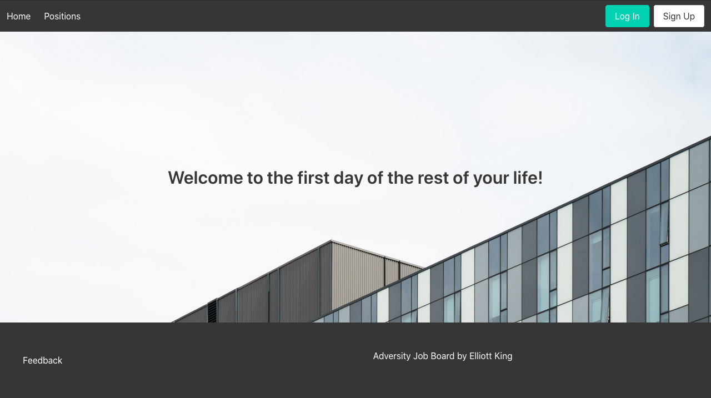
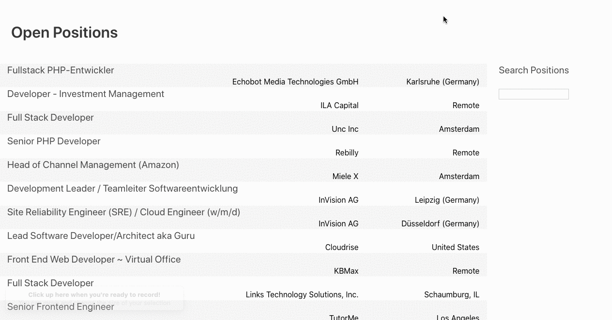
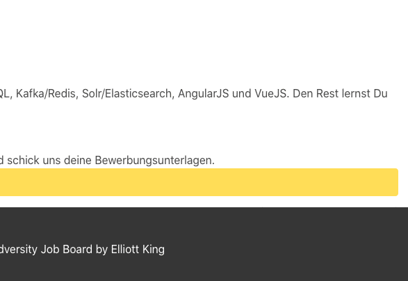
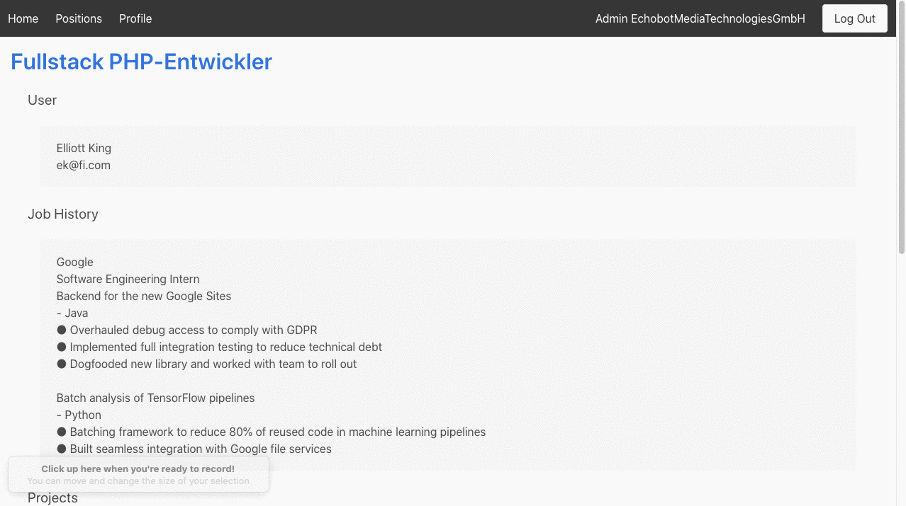

# Adversity Job Board
For when you want your applicants to _really_ work for it. This is a tongue-in-cheek job board addressing some common complaints with the job search process.

## Features
The job board comes with everything needed for an applicant to apply, or for a company to look for applicants. It even parses resumes! The goal was to create a job site where the UI is familiar, but the UX is absolute insanity.

||
| --- |
|The search feature will narrow down the number of results, but will intentionally return nothing useful. We only want to reward the most _dedicated_ applicants.|

||
| --- |
|An old friend helps out with your application. Clippy will provide some useful suggestions for each section.|

||
| --- |
|We are all familiar with uploading a resume, then still being required to fill out all of the fields. This takes it a step further. We do parse your resume (shoutout to [pyresparser](https://github.com/OmkarPathak/pyresparser)), but we intentionally insert small typos. Of course, we understand that companies are looking only for the truly _detail oriented_ applicants.|

||
| --- |
|A company can log in and send messages to its applicants. We understand that your time is valuable, and therefore you can use one of our built-in messages if you prefer.|

||
| --- |
|And of course, we take feedback _very_ seriously.|

## Setup
If you want to run locally, you will need to also set up the sister [backend repository](https://github.com/elliott-king/hostile-board-backend). First follow the directions there. 

To run this, simply:
1. `git clone https://github.com/elliott-king/adversity-board-frontend.git`
2. `yarn install`
3. Make sure to change the url in `requests.js` to the localhost port the backend is running on (you can also leave as-is, and it will connect to my heroku backend)
4. `yarn dev`
